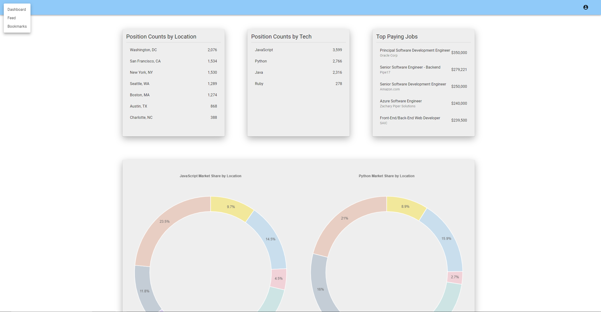
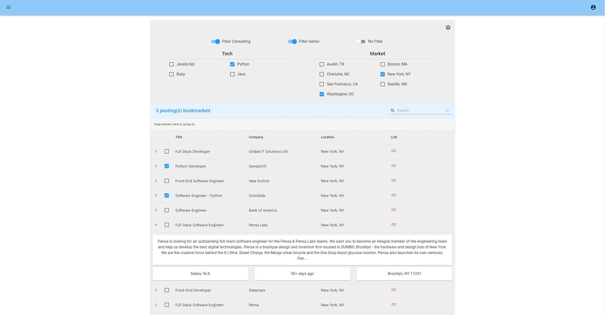

<h3 align='center'>This is the client-side React app for powering my App Academy capstone project: <a href='https://github.com/ColeRutledge/pure_search'>PureSearch</a></h3>

---

    <a href='https://pure-search-client.herokuapp.com' target='_blank'>Link to live demo -> Click on Demo User</a> <i>you may have to give Heroku a minute!<i> 

 

